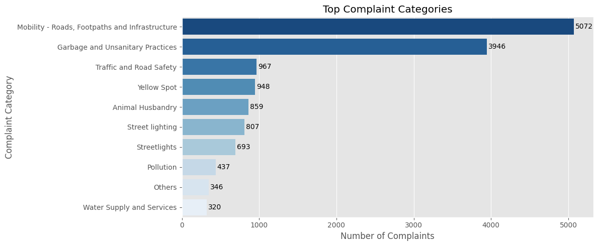
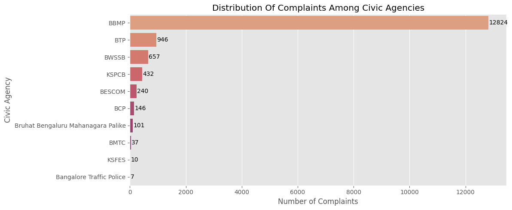
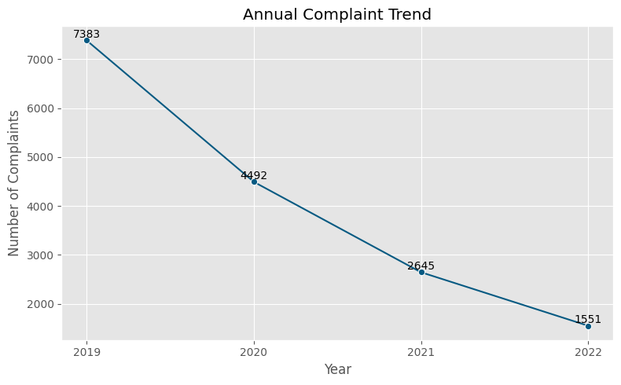

# Bengaluru Municipality Issue Analysis

Exploratory Data Analysis of civic complaints submitted to Bengaluru Municipality between 2019 and 2022, sourced from the **I Change My City** platform by Janaagraha.

---

## Project Overview

Bengaluru's municipal corporation (BBMP) and allied civic agencies receive thousands of citizen complaints every year through the *I Change My City* portal — covering everything from potholes to garbage collection to streetlight failures. This project analyzes that complaint log to answer a few practical questions:

- What issues do citizens report most frequently?
- Which civic agencies receive the highest complaint load?
- How effectively are complaints being resolved, and where are the gaps?
- How has complaint volume changed year over year?
- Which wards generate the most complaints?

---

## Project Structure

```
Bengaluru-Municipality-Issue-Analysis/
│
├── data/
│   └── a60abf5c-3a15-4967-af32-c3074248580f.csv
│
├── plots/
│   └── (chart images generated by the notebook)
│
├── BLR_Municipality_Issue_Analysis.ipynb
├── BLR_Municipality_EDA_Slides.pptx
├── requirements.txt
└── README.md
```

---

## Dataset

| Field | Details |
|-------|---------|
| Source | [OpenCity — data.opencity.in](https://data.opencity.in/dataset/i-change-my-city-data/resource/a60abf5c-3a15-4967-af32-c3074248580f) |
| Platform | I Change My City — Janaagraha |
| Period | January 2019 – December 2022 |
| Records | 16,071 complaints |
| Key Columns | category, sub-category, ward, civic agency, complaint status, created date, comment count |

The raw dataset is included in the `data/` folder. If it's missing, it can be downloaded directly from the OpenCity link above.

---

## Analysis Workflow

1. **Data Overview** — inspecting shape, data types, and column structure
2. **Data Quality Assessment** — checking for missing values and duplicate records
3. **Feature Engineering** — parsing inconsistent date formats and extracting year, month, and day-of-week
4. **Complaint Category Analysis** — most frequently reported categories and sub-issues
5. **Complaint Status Analysis** — breakdown of complaints by resolution status
6. **Civic Agency Analysis** — complaint distribution across responsible agencies
7. **Complaint Trends** — year-wise complaint volume across the study period
8. **Key Insights** — summarizing findings from the analysis

---

## Key Insights

- Road infrastructure and sanitation-related issues account for a significant share of reported complaints — *Mobility (Roads, Footpaths & Infrastructure)* and *Garbage and Unsanitary Practices* together make up over 56% of all complaints.
- **BBMP** handles the overwhelming majority of complaints (12,824 of 16,071), with all other agencies — BTP, BWSSB, KSPCB, BESCOM — receiving far smaller shares.
- Of all complaints, **54.9% remain Open** and only **30.7% are marked Resolved**, indicating a significant backlog in complaint handling. A further 2.1% were Re-opened after closure.
- Complaint volumes declined **79%**, from 7,383 in 2019 to 1,551 in 2022. The steepest drop occurred in 2020, likely linked to COVID-19 lockdowns reducing citizen mobility and reporting activity. The continued decline post-2020 may reflect service improvements, lower platform engagement, or incomplete data capture for later years.
- Complaint reporting is concentrated in a limited number of wards — **Bellanduru, Begur, and Horamavu** report the highest volumes, pointing to localized service demand.

---

## Visualizations

**Top Complaint Categories**



**Complaint Distribution by Civic Agency**



**Annual Complaint Trend (2019–2022)**



Additional charts (sub-issues, status distribution, ward-level breakdown) are available in the `plots/` folder and inside the notebook.

---

## How to Run This Project

### 1. Clone the Repository

```bash
git clone https://github.com/Vaibhav-code15/Bengaluru-Municipality-Issue-Analysis.git
cd Bengaluru-Municipality-Issue-Analysis
```

### 2. Install Dependencies

```bash
pip install -r requirements.txt
```

### 3. Run the Notebook

```bash
jupyter notebook BLR_Municipality_Issue_Analysis.ipynb
```

Run all cells top to bottom (`Kernel → Restart & Run All`). All charts will regenerate and save to the `plots/` folder.

---

## Tools & Libraries

| Tool | Purpose |
|------|---------|
| Python 3.14.5 | Core programming language |
| Pandas | Data loading, cleaning and analysis |
| NumPy | Numerical operations |
| Matplotlib | Data visualization |
| Seaborn | Statistical charts |
| Jupyter Notebook | Interactive development environment |

---

## Presentation

A 3-slide summary presentation (`BLR_Municipality_EDA_Slides.pptx`) is included in this repository, covering the project overview, key complaint categories, and overall complaint trends.

---

## License

This project is licensed under the [MIT License](LICENSE).

---

## Author

**Vaibhav Khandelwal**

B.Tech Computer Science Engineering
Jaypee Institute of Information Technology, Noida

[](https://github.com/Vaibhav-code15)
[](https://www.linkedin.com/in/vaibhav-khandelwal-5a532b28a/)

---

*Dataset: [I Change My City — OpenCity](https://data.opencity.in/dataset/i-change-my-city-data/resource/a60abf5c-3a15-4967-af32-c3074248580f). This project was built for educational and portfolio purposes.*
